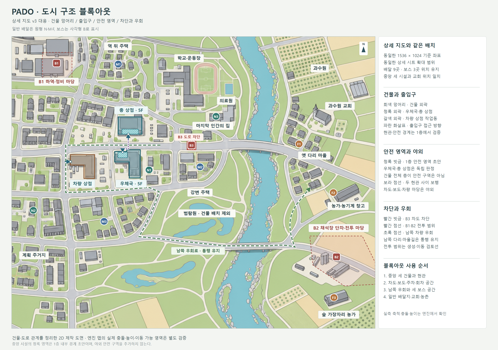
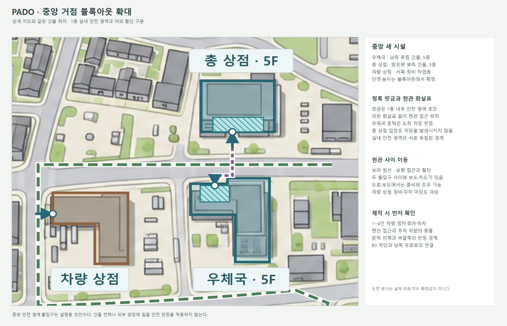

# 중앙 생활권·농촌 상세 및 블록아웃 v3

[생활권 상세 PNG](도시_중앙생활권_상세_v3.png) · [중앙 거점 블록아웃 확대](중앙_거점_블록아웃.png) · [수정 가능한 블록아웃](도시_구조_블록아웃.svg) · [전체 도면](도시_전체_도면.md) · [지도 표시 좌표](도면_원본_v3/지도_표시_좌표_v3.json)

## 블록아웃 도면에서 바로 읽을 것

이번 블록아웃은 생활권 상세 지도 v3를 단순화한 **2D 제작 도면**이다. 상세 지도와 같은 `1536 × 1024` 기준 좌표, 같은 `380, 70, 1156, 954` 확대 범위를 사용한다. 중앙 세 시설·교회·배달 9곳·보스 3곳을 대응시켰다. 배경의 일반 건물은 위치와 덩어리를 읽기 위한 단순화이며, 핵심 시설 경계·출입구·안전 영역·우회 표시는 별도의 수정 가능한 도형이다.

| 표시 | 뜻 | 제작 시 확인 |
|---|---|---|
| 회색 건물 덩어리 | 상세 지도에서 가져온 건물 외곽과 안뜰 관계 | 일반 건물은 기본 박스로 옮기고 현관·마당·골목 접근을 확인한다. |
| 청록색 굵은 외곽 | 중앙 우체국과 총 상점의 독립된 건물 덩어리 | 두 건물을 각각 5층 도심 건물로 잡고 1층 출입구를 중앙대로 쪽으로 둔다. |
| 갈색 굵은 외곽 | 차량 상점 작업동 | 서쪽 정비 골목에서 진입하고 작업동·정비 베이·회차 마당을 구별한다. 차량 상점의 층수는 별도 확정한다. |
| 청록 빗금 | 우체국·총 상점 **1층 내부 안전 영역의 경계 초안** | 위에서 본 층 투영이며 건물 전체 층·마당의 안전 판정을 뜻하지 않는다. 실제 1층 실내 평면에 맞춰 경계를 확정한다. |
| 파란 화살표 | 도로·마당에서 현관으로 들어가는 방향 | 화살표 끝의 원은 현관 접근 위치 초안이다. 월드 좌표와 문턱 판정은 별도 배치한다. |
| 보라 점선 | 우체국 현관과 총 상점 현관 사이 보행 동선 | 두 문 사이에 보도·차도가 남아 있고 야외에서 좀비와 조우할 수 있어야 한다. |
| 빨간 빗금 | B3가 막을 중앙대로 차도 구간 | 양쪽 차도를 관통할 수 없도록 보스 충돌을 확인하고 보스 앞까지의 접근은 허용한다. |
| 빨간 점선 범위 | B1 하역장·B2 채석장 전투 공간 초안 | 생성·이동·엄폐 검토 범위다. 경기장 벽이나 접근 금지 구역을 추가하지 않는다. |
| 초록 점선 | 중앙 생활권에서 남쪽 다리·마을길로 이어지는 차량 우회 | 실제 도로를 따라 연결한다. 이 표시는 별도 신규 도로나 확정된 최단 경로를 뜻하지 않는다. |

[블록아웃 구조 좌표](도면_원본_v3/블록아웃_구조_좌표_v3.json)는 도면 안의 건물 외곽·현관·안전 영역 초안을 기록한다. **엔진 레벨을 수정하거나 실제 충돌·내비게이션을 검증한 결과는 아니다.** 생활권 상세 지도는 경관·도시 구조 검토용으로 함께 사용하고, 블록아웃은 건물 덩어리와 이동·판정 관계를 읽는 제작 기준으로 쓴다.

## 이번 배치의 기준

**우체국·총 상점·차량 상점은 도시 중앙에 모인다.** 나머지 배치는 사람이 일하고 장을 보고 학교에 다니며 집으로 돌아오던 동선이 드러나도록 재구성했다. 도면은 전체 도시의 중앙·동부를 확대한 것으로, 별개의 새 맵이나 도시 경계를 뜻하지 않는다.

우체국은 중앙대로 남쪽의 독립된 도심 건물, 총 상점은 맞은편 북쪽 건물, 차량 상점은 우체국 서쪽 정비 골목의 작업장으로 둔다. 우체국과 총 상점은 기존 기획대로 5층 현대·근미래 건물의 1층에 들어간다. 건물 사이 차도·보도는 일반 좀비가 활동하는 야외 공간이다. 차량 상점의 정비·주차 마당은 중앙 생활권 안에 있으며 다른 시설의 출입 동선과 충돌하지 않게 배치한다.

이전 약 2.0 × 1.6km는 동부 상세 구역의 초기 개념값이었다. 이번 시트는 재구성한 도시의 같은 배경을 잘라 확대한 **실측 축척 미확정 관계도**다. 거리와 등급은 실제 차량 주행으로 검증한다. 별도 레벨 전환 없이 전체 도시와 이어지는 기존 조건을 유지한다.

## 생활 구조를 블록아웃으로 옮길 때

| 장소 | 사람이 사용했던 구조 | 좀비게임에서 확인할 것 |
|---|---|---|
| 우체국 앞 | 보도에서 현관으로 들어가는 짧은 보행 접근, 차량 정차·배송 준비 마당 | 좀비를 피하며 문턱에 접근할 공간. 차량이 현관을 완전히 막지 않게 한다. 우체국 도착 저장 판정은 기존 규칙을 따른다. |
| 총 상점 앞 | 우체국 맞은편 점포의 도로 방향 출입구 | 횡단할 때 좀비와 마주칠 거리. 실내는 별도 안전 구역이며 출입만으로 저장하지 않는다. |
| 차량 상점 | 작업동·정비 베이·차량 회차와 공동 주차 마당 | 1~4인의 차량 구매·수리·진입 동선. 야외 마당을 새 안전 구역으로 취급하지 않는다. |
| 시장 주변 | 점포 앞 보도·작은 광장, 뒤편 하역 골목과 안뜰 | 정면 도로와 뒤편 보행 우회가 다르게 읽혀야 한다. 적재물과 폐차는 시야와 엄폐를 만들되 유일한 접근로를 막지 않는다. |
| 주택가 | 길을 향한 현관, 필지 안쪽 마당, 공동 주차·쓰레기 수거 공간 | 차량을 세운 뒤 현관까지의 짧은 보행. 담장·증축·골목이 다른 사격 시야와 우회 선택을 만든다. |
| 학교·의료원 | 운동장과 출입 마당, 도로에 연결된 의료원 진입로 | 학교 울타리와 현관의 읽기 쉬운 접근. 의료원 배송 지점은 도로·학교 운동장과 혼동되지 않게 한다. |
| 강변 공원 | 주택의 높은 부지와 낮은 범람원, 제방·보행길·습지 | 넓은 시야와 접근로 변화를 주되 차량은 연결 도로를 사용한다. 공원의 열린 땅을 빽빽한 건물로 바꾸지 않는다. |
| 교회·과수원 | 교회 앞 모임 마당·작은 주차 공간, 농로, 수목열과 선별·기계 작업장 | 교회와 숲·농가가 구별되는 랜드마크. 교회는 경관 시설로만 추가하며 새 배달 ID·안전 구역·임무를 부여하지 않는다. |

## 배달지와 보스

일반 배달 9곳과 보스 3곳의 ID·수취인 설정은 [배달 콘텐츠 진행표](../공용/09_배달_콘텐츠_진행표.md)를 따른다. 주변 배치는 이번 도면에 맞춰 이동했으므로 이전 SVG의 핀 좌표를 새 이미지에 그대로 적용하지 않는다.

| 도면 표시 | 목적지 ID | 장소와 접근 성격 |
|---|---|---|
| N1 | GEN-N01 | 우체국 동쪽 중앙 생활권의 상가 주택. 첫 차량 배달과 현관 접근을 먼저 검증한다. |
| N2 | GEN-N02 | 남서 계획 주거지의 연립주택. ‘충전 중’ 로봇 수취인, 생활도로·공동 주차 공간을 이용한다. |
| N3 | GEN-N03 | 학교 옆 의료원. 독립된 진입 마당을 통해 현관으로 들어간다. |
| M1 | GEN-M01 | 역 뒤 노동자 주택. 물류 간선도로에서 작은 주거 골목으로 갈라진다. |
| M2 | GEN-M02 | 강변 주택. 생활도로와 공원 보행 접근이 만난다. |
| M3 | GEN-M03 | 남쪽 저층 주택. 남쪽 우회로와 연결되는 주거 골목을 사용한다. |
| F1 | GEN-F01 | 옛 다리 마을 주택. 주 교량을 건넌 뒤 마을길에서 현관으로 접근한다. |
| F2 | GEN-F02 | 과수원 옆 농가·농기계 작업장. ‘충전 중’ 로봇 수취인, 작업 마당과 농로를 이용한다. |
| F3 | GEN-F03 | 숲 가장자리 농가. 마을길에서 별도의 짧은 진입로로 들어간다. |
| B1 | BOSS-01 | 북서 정비 창고·하역장. 긴 창고와 차량·적재물을 이용하는 전투 공간. |
| B2 | BOSS-02 | 동남쪽 폐채석장. 단차·작업 바닥·농촌 진입로가 다른 이동 선택을 만든다. |
| B3 | BOSS-03 | 마지막 인간의 집 앞 중앙대로 동쪽 접근. 우체국에서 보이는 도로를 차단하고 남쪽 우회·다리는 유지한다. |

[표시 좌표 JSON](도면_원본_v3/지도_표시_좌표_v3.json)은 **1536 × 1024 배경 이미지 안의 픽셀 위치**다. 월드 좌표·실측 거리·현관 상호작용점·보스 생성점이 아니다. 모든 PNG·SVG가 이 표시 좌표를 공유해 확대 시트의 위치가 서로 어긋나지 않게 했다.

## 중앙 차단과 남쪽 우회

B3는 중앙대로 동쪽 접근을 막는다. 우체국 출입구와 앞 보도에서 보스가 막는 직선 구간을 읽을 수 있어야 한다. 마지막 인간의 집은 이 구간 옆에 놓고, 도로가 차단되어도 보스 앞까지 접근할 수 있게 한다.

남쪽 생활도로 → 강변 우회로 → 남쪽 다리 → 마을길은 일반 배달의 대체 경로다. 보스 충돌·좀비 생성·폐차 장식이 이 경로까지 닫지 않게 한다. 지도에 보이는 북쪽 교량의 최종 통행 여부는 블록아웃에서 결정하되, B3가 막은 동일 구간을 관통하는 길로 연결하지 않는다.

최종 집 앞에는 택배 소지자의 상호작용 위치와 팀 재개 위치, 결말에서 좀비가 나올 출구를 잡는다. 저장·결말·보스 재등장 규칙은 기존 공용 기획을 유지한다.

## 글자와 검증

지도 글자는 제작용으로만 쓴다. 시설명은 연결선으로 실제 건물을 가리키고 구역명·도로명은 크기를 달리했다. 배달은 원형, 보스는 사각형으로 구별한다. 이미지 생성 글씨 대신 별도의 한국어 문자 레이어를 사용해 PNG에서도 선명하게 읽힌다. 게임 속 간판·현수막·도로 표지에는 글자를 넣지 않는 기존 규칙을 유지한다.

1. 중앙 세 시설, 우체국·총 상점 실내 경계, 두 건물 사이 야외를 먼저 회색 박스로 만든다.
2. 차량 상점 → N1 배송 → 우체국 복귀를 1인·4인으로 검증한다. 차량 정차·회차와 현관 보행 접근을 함께 본다.
3. 주택 골목·물류 도로·학교·강변·농촌을 연결한다. 사람의 기존 접근로와 플레이어의 우회가 모두 읽히도록 한다.
4. B3 도로 차단과 남쪽 다리의 독립된 통행, 세 보스 전투 공간, 마지막 집 체크포인트를 확인한다.
5. `수락 → 차량 접근 → 실제 주행 → 전투 → 현관 배송` 시간을 잰다. 가까움 4/7분·중간 6/9분·멂 8/12분은 [첫 플레이 테스트 기준](../공용/07_배달_상태와_저장_규칙.md)이며 실제 측정 뒤 거리 등급·도로 길이를 조정한다.

기존 [v4 동부 블록아웃](보관/2026-09-30_블록아웃_정합화_전/도시_구조_블록아웃.png)과 [첫 경관 개선안](도시_구조_블록아웃_개선안.png)은 비교 자료로 보존했다. 현재 검토 기준은 상단의 도시 구조 블록아웃·중앙 거점 확대와 생활권 상세 지도 v3다.
