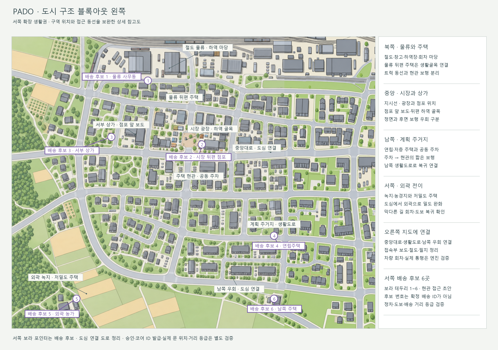
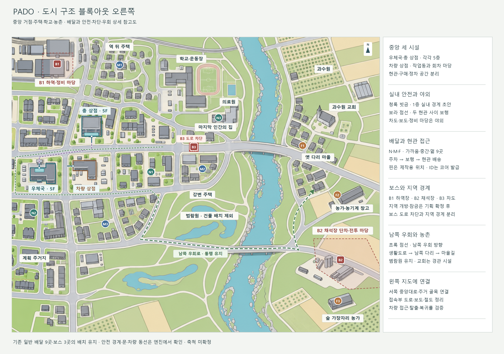

# 도시 구조 블록아웃 — 전경·왼쪽·오른쪽

현재 참고 지도는 **전경·왼쪽·오른쪽 3장**이다. 전경은 두 상세 지도와 같은 배경·배치·문자 표시를 사용한다. 각 지도 오른쪽의 간단한 제작 설명을 함께 읽는다.

| 지도 | 참고할 내용 | 먼저 만들 것 |
|---|---|---|
| [전경](도시_구조_블록아웃.png) | 전체 배치와 두 구역의 연결, 중앙 차단·남쪽 우회 | 중앙대로와 남쪽 생활도로의 연결·복귀 경로 |
| [왼쪽 상세](도시_구조_블록아웃_왼쪽.png) | 서쪽 물류·시장·상가·계획 주거지·외곽 | 점포 앞 보도·뒤편 하역 골목·주차에서 현관까지 보행·회차 |
| [오른쪽 상세](도시_구조_블록아웃_오른쪽.png) | 중앙 세 시설, 배달 9곳·보스 3곳, 출입구·실내 경계·우회 | 두 시설의 1층 경계·현관 사이 야외·차량 상점 접근 |

## 왼쪽 생활권의 제작 포인트

| 위치 | 구역 역할 | 레벨에서 확인 |
|---|---|---|
| 북쪽 | 철도 물류·창고·하역 마당·뒤편 주택 | 트럭 회차와 현관 보행을 분리하고 기존 B1과 겹치는 창고·필지를 정리한다. |
| 중앙 | 시장 광장·상가·뒤편 하역 골목 | 점포 앞 보도와 후면 접근을 구분하고 적재물·폐차로 유일한 접근로를 막지 않는다. |
| 남쪽 | 연립·저층 주택·공동 주차 | 주차에서 현관까지 짧은 보행과 남쪽 생활도로 복귀를 연결한다. |
| 서쪽 외곽 | 저밀도 주택·녹지·농경지 | 도심에서 외곽으로 밀도를 줄이고 막다른 길 회차·도보 복귀를 확인한다. |
| 오른쪽 경계 | 기존 도심과 접속 | 도면에서 중앙대로·생활도로·남쪽 우회와 철도를 연결했다. 엔진에서는 실제 도로 폭·높이·회차·통행을 검증한다. |

양쪽 지도 사이의 도로 단절을 정리했다. **중앙대로·생활도로·남쪽 우회·철도가 이어지는 하나의 배경**을 사용하고, 전경과 양쪽 상세는 이 배경을 함께 사용한다. 이전 갈색 경계 점선은 제거했다. 연결부의 보도·교차로·필지와 잘린 창고·주택 지붕을 정리했으며 실측 축척·높이·차량 통행은 엔진에서 검증한다. 회색 지시선은 구역 설명, 보라 테두리 포인터는 배송 후보다. 새 배달 ID·보스·안전 구역은 지정하지 않았다.

## 서쪽 배송 후보 포인터

전경과 왼쪽 상세에 **보라 테두리 원형 1~6**을 표시했다. 기존 오른쪽 N·M·F 배송지와 구별되는 제안이며 확정 배송지나 발급 ID가 아니다. 포인터는 현관 접근 위치의 초안이다. 실제 문·정차·상호작용점은 레벨에서 배치하고 거리 등급·제한시간은 주행 측정과 기획 승인 후 정한다.

| 후보 | 제안 장소 | 배송에 사용할 공간 | 먼저 검증할 것 |
|---|---|---|---|
| 1 | 물류 사무동 | 하역장 옆 사무동 출입구·차량 정차 | 대형 차량 회차와 현관 보행이 충돌하지 않는지 |
| 2 | 시장 뒤편 점포 | 하역 골목의 점포 출입구 | 중앙대로에서 정차한 뒤 골목으로 접근·복귀 가능한지 |
| 3 | 서부 상가 | 상가 전면 보도와 출입구 | 보도를 차가 막지 않는 정차 위치와 보행 우회 |
| 4 | 계획 주거지 연립주택 | 공동 주차·주동 현관 | 주차장에서 해당 현관까지 식별 가능한 보행 동선 |
| 5 | 외곽 농가 | 농로 끝 마당·농가 현관 | 진입로 회차·차량 파괴 시 도보 복귀 |
| 6 | 남쪽 저층 주택 | 남쪽 생활도로 인접 필지·현관 | 우회로를 막지 않는 정차와 주거 골목 재진입 |

추가 확정 시 기획의 배송지 추가 승인과 코어 ID 발급을 거쳐 Anchor에 연결한다. 기존 일반 배달 9곳·보스 3곳의 수나 ID를 이 후보 번호로 변경하지 않는다.

## 원본과 수정

[전경 SVG](도면_원본/도시_구조_블록아웃.svg) · [왼쪽 SVG](도면_원본/도시_구조_블록아웃_왼쪽.svg) · [오른쪽 SVG](도면_원본/도시_구조_블록아웃_오른쪽.svg) · [3장 출력 도구](도면_원본/지도_3장_출력.ps1)

거점의 이름·시설 외곽·실내 경계·현관·보행·우회 표시는 출력 도구에서 좌표와 문구로 정의한다. [연결 배경](도면_원본/도시_연결_배경.png)은 최신 거점 배치를 반영한 전체 이미지다. 출력 도구는 이동 전 배경과 수정한 거점 배경을 합친 뒤 3장을 함께 출력한다. 기존 배송지·보스·서쪽 배송 후보는 유지했다. 기존 지도·중앙 확대·추출본은 [이전 지도 보관](보관/2026-10-02_지도_3장_정리_전/), 도로 연결 전 자료는 [도로 연결 전 보관](보관/2026-10-02_도로_연결_전/)에 모았다.

## 도면의 성격

건물 덩어리·출입구·중앙 시설·전투장·우회 관계를 읽는 **2D 제작 도면**이다. 전경은 5250 × 2110, 왼쪽·오른쪽은 각각 3000 × 2110이다. 출력 크기이며 엔진 월드의 실측 축척이 아니다. 각 지도 이미지의 픽셀 좌표는 서로 다르다.

배경의 일반 건물은 위치와 덩어리를 읽기 위한 단순화다. 핵심 시설 경계·출입구·안전 영역·우회 표시는 수정 가능한 도형이며, 엔진 레벨·실제 충돌·높이·내비게이션을 검증한 결과가 아니다. 과거 약 2.0 × 1.6km 표기는 초기 동부 개념값이었으므로 현재 실측 축척으로 쓰지 않는다.

## 블록아웃 도면에서 읽을 것

| 표시 | 뜻 | 제작 시 확인 |
|---|---|---|
| 회색 건물 덩어리 | 일반 건물 외곽과 안뜰 관계 | 기본 박스·현관·마당·골목 접근 |
| 청록색 굵은 외곽 | 중앙 우체국과 총 상점의 독립된 건물 덩어리 | 각각의 현관을 중앙대로 쪽으로 배치 |
| 갈색 굵은 외곽 | 차량 상점 작업동 | 서쪽 정비 골목 진입·정비 베이·회차 마당. 층수는 별도 확정 |
| 청록 빗금 | 1층 내부 경계 초안 | 실제 실내 평면에 맞춰 경계 검수 |
| 파란 화살표 | 도로·마당에서 현관으로 들어가는 방향 | 화살표 끝의 원은 접근 위치 초안. 월드 문턱은 별도 배치 |
| 보라 점선 | 우체국·총 상점 현관 사이 보행 동선 | 보도·차도·시야·횡단 접근 |
| 빨간 빗금 | B3가 막을 중앙대로 차도 구간 | 보스 자체의 도로 차단과 별도 지역 경계 구분 |
| 빨간 점선 | B1 하역장·B2 채석장 전투 공간 초안 | 생성·이동·엄폐·도보/차량 진입. 지역 정책은 미결정 사항 확인 후 반영 |
| 초록 점선 | 남쪽 다리·마을길로 이어지는 차량 우회 | 실제 도로 연결. 신규 도로·확정 최단 경로를 뜻하지 않음 |

중앙 시설의 출입구와 내부 경계는 [오른쪽 상세](도시_구조_블록아웃_오른쪽.png)에서 확인한다.

## 배치와 생활 구조

이번 수정은 **우체국과 차량 상점의 위치를 교환한 뒤, 세 시설을 모두 서쪽 인접 블록으로 이동**한 배치다. 한 블록은 지도상의 인접 필지를 뜻하며 확정 미터 단위 거리가 아니다.

| 시설 | 새 위치 | 출입·동선 |
|---|---|---|
| 우체국 · 5F | 중앙대로 남쪽, 세 시설 중 가장 서쪽 블록 | 북측 현관·배송 준비 앞마당·정차 공간. 실내 안전 영역은 별도 청록 빗금 표시 |
| 차량 상점 | 우체국 동쪽 남측 블록 | 서측 정비 골목에서 작업동 진입. 정비 베이·회차·주차 마당 구분 |
| 총 상점 · 5F | 차량 상점 건너편 북측 블록, 우체국의 북동쪽 | 남측 현관. 우체국에서 보도를 따라 이동한 뒤 차도를 건너 접근 |

우체국과 총 상점은 대각선으로 도로를 사이에 두며, 현관 사이에 야외 보행·횡단이 남는다. 보라 점선·파란 진입 화살표·청록 실내 경계와 초록 남쪽 우회 표시는 새 위치에 맞췄다. 기존 우체국·총 상점 자리는 일반 상가·주택으로 바꾸고 N1 등 기존 배송지 표시는 유지했다. 주변은 사람이 일하고 장을 보고 학교에 다니며 집으로 돌아오던 동선이 읽히도록 만든다. 별개의 새 맵이나 확정 도시 경계를 뜻하지 않는다.

| 장소 | 사람이 사용했던 구조 | 블록아웃 검수 |
|---|---|---|
| 우체국 앞 | 보도→현관 접근, 차량 정차·배송 준비 마당 | 현관을 막지 않는 주차·회차와 보행 |
| 총 상점 앞 | 북측 점포의 도로 방향 출입구 | 우체국 북동쪽으로 보행·횡단한 뒤 현관 접근 |
| 차량 상점 | 작업동·정비 베이·회차·공동 주차 마당 | 구매·수리·차량 진입 동선 |
| 시장 | 점포 앞 보도·광장, 뒤편 하역 골목·안뜰 | 정면과 뒤편 우회 구분. 적재물·폐차가 유일한 길을 막지 않게 함 |
| 주택가 | 길을 향한 현관, 안쪽 마당·공동 주차·쓰레기 수거 | 정차 뒤 보행, 담장·증축·골목의 시야와 우회 |
| 학교·의료원 | 운동장·출입 마당·의료원 진입로 | 학교 울타리와 현관 식별, 의료원 배송점 구분 |
| 강변 공원 | 높은 주택 부지와 낮은 범람원·제방·습지 | 열린 시야와 접근로. 차량 연결 도로와 열린 땅 유지 |
| 교회·과수원 | 모임 마당·주차·농로·수목열·선별/기계 작업장 | 교회·숲·농가의 경관 구분. 추가 임무/배송지 제안과 경관 제작을 구분 |

## 배송지와 전투 공간 대응표

N1/M1/F1/B1 표시는 도면에서 위치를 구분하는 **제작용 표기**다. 실제 배송지 ID가 아니며 코어 발급 ID와 Anchor 매칭을 따로 기록한다. 도면 픽셀 위치는 실제 월드 위치·현관 상호작용점·보스 생성점·게임 지도 좌표가 아니다.

| 도면 표시 | 요청 항목(문서용) | 장소와 접근 성격 |
|---|---|---|
| N1 | 가까운 배송지 1 | 우체국 동쪽 중앙 생활권 상가 주택. 첫 차량 배달·현관 접근 검수 |
| N2 | 가까운 배송지 2 | 남서 계획 주거지 연립주택. 생활도로·공동 주차 |
| N3 | 가까운 배송지 3 | 학교 옆 의료원. 독립 진입 마당·현관 |
| M1 | 중간 배송지 1 | 역 뒤 노동자 주택. 물류 간선도로→주거 골목 |
| M2 | 중간 배송지 2 | 강변 주택. 생활도로·공원 보행 접근 |
| M3 | 중간 배송지 3 | 남쪽 저층 주택. 남쪽 우회로 연결 주거 골목 |
| F1 | 먼 배송지 1 | 옛 다리 마을 주택. 교량→마을길→현관 |
| F2 | 먼 배송지 2 | 과수원 옆 농가·농기계 작업장. 작업 마당·농로 |
| F3 | 먼 배송지 3 | 숲 가장자리 농가. 마을길의 짧은 진입로 |
| B1 | 첫 보스 배송지 | 북서 정비 창고·하역장. 긴 창고·차량·적재물 전투 공간 |
| B2 | 둘째 보스 배송지 | 동남 폐채석장. 단차·작업 바닥·농촌 진입로 |
| B3 | 최종 보스 배송지 | 최종 집 앞 중앙대로 동쪽 접근. 도로 차단·남쪽 우회 관계 |

건물·현관·상호작용점·보스 생성점·수취인/마커 위치는 엔진에서 실제 월드 좌표로 배치한다. 도면에는 제작용 명칭을 쓰고 게임 표시명·배송지 데이터 연결·지도 변환과 구분한다.

## 중앙 차단과 남쪽 우회

B3의 중앙대로 차단은 우체국 출입구와 앞 보도에서 읽히게 한다. 최종 집은 그 구간 옆에 두고 보스 원경·진입로·지역 경계를 함께 검토한다. 미결정 보스 정책은 [기획 원본의 해당 항목](../기획_PM/00_게임기획.md#보스-규칙-미결정)을 보조로 참조하며 도면에서 정책을 확정하지 않는다.

남쪽 생활도로 → 강변 우회로 → 남쪽 다리 → 마을길은 대체 경로다. 보스 충돌·스폰·폐차 장식으로 이 길까지 닫지 않게 검수한다. 북쪽 교량의 최종 통행 여부는 블록아웃에서 결정하되 B3의 동일 차단 구간을 관통하는 길로 연결하지 않는다.

최종 집 앞에는 택배 상호작용·팀/차량 재개·연출 출구를 배치한다. 실제 저장·결말 판정은 해당 담당의 계약에 연결한다.

## 제작과 검수 순서

1. 중앙 세 시설·현관·실내 경계·차도·보도를 회색 박스로 만든다.
2. 차량 상점→N1→우체국 복귀에서 정차·회차·현관 보행을 검수한다.
3. 주택 골목·물류 도로·학교·강변·농촌의 생활 접근과 플레이 우회를 연결한다.
4. 중앙대로 차단·남쪽 다리 통행·세 전투장·최종 집 재개/연출 공간을 확인한다.
5. 수락·차량 접근·실제 주행·전투·현관 배송 시간을 나눠 측정하고 승인 목표에 맞춰 도로 길이·동선을 조정한다.
6. 배송지 ID·Anchor·현관 위치의 누락·중복·정의 불일치를 검수한다.
7. 스폰 가능/금지/밀도·NavMesh·이동 불가 영역과 차량/AI가 끼는 지형, 부활 뒤 재합류·차량 파괴 뒤 복귀·전투장 탈출을 확인한다.

지도 글자는 제작용이다. 시설·구역의 지시선과 도로 설명을 구분한다. 배달은 원형, 보스는 사각형으로 표시한다. 서쪽 확장 제안의 승인·엔진 반영 상태는 [레벨 작업 문서](02_레벨디자이너.md)에 기록한다.
